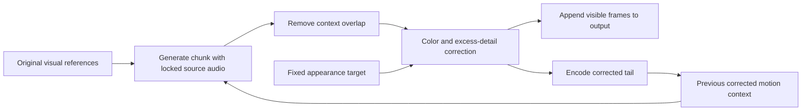

# MiniMax H3 Director — Long-Audio Lip Sync

Generate a continuous talking video from a complete audio recording using **FL2VA** or **ref2va**. The long-audio nodes plan and generate overlapping chunks automatically, carry motion context between chunks, and return the original soundtrack. Optional color and detail correction counters accumulating color drift and oversharpening.

This fork adds audio-driven generation to the original MiniMax H3 Director. Its full English documentation is included at the end, covering the timeline, reference groups, video editing, Refine/upscaling, and director packs.

**Fork:** [omegasrsw/ComfyUI_MiniMaxH3_Director](https://github.com/omegasrsw/ComfyUI_MiniMaxH3_Director) · **Original project:** [AIMixer/ComfyUI_MiniMaxH3_Director](https://github.com/AIMixer/ComfyUI_MiniMaxH3_Director) · **Original Chinese guide:** [README_ZH.md](README_ZH.md)

## Contents

- [Choose a model and workflow](#choose-a-model-and-workflow)
- [Install and prepare the models](#install-and-prepare-the-models)
- [FL2VA walkthrough](#fl2va-walkthrough)
- [Ref2VA walkthrough](#ref2va-walkthrough)
- [Suggested starting presets](#suggested-starting-presets)
- [Complete node parameter guide](#complete-node-parameter-guide)
- [Whole-video latent outputs for upscaling](#whole-video-latent-outputs-for-upscaling)
- [Color and sharpness stabilization](#color-and-sharpness-stabilization)
- [Preserving the exact input audio](#preserving-the-exact-input-audio)
- [How chunk timing and context work](#how-chunk-timing-and-context-work)
- [Troubleshooting and practical limits](#troubleshooting-and-practical-limits)
- [Original English README](#original-english-readme)

## Choose a model and workflow

| Use case | Node name in ComfyUI | Diffusion model | Visual inputs |
|---|---|---|---|
| Animate a portrait or an already composed scene | **MiniMax H3 Director Long Audio Lip Sync** | **fl2va** | One `first_frame` image |
| Combine a character with a background, clothing, props, or other references | **MiniMax H3 Director Ref2VA Audio Lip Sync** | **ref2va** | `ref_image_1` through `ref_image_9` |
| Save either node's result with sample-exact audio | **MiniMax H3 Save Video (Exact Audio)** | No model | Generated images, original audio, and fps |

**Naming:** “FL2V” refers to the first/last-frame model family; its checkpoint name contains `fl2va`. This long-audio node uses a **first frame only**. It does not expose the original timeline Director's last-frame, Refine, or group controls. Ref2va images guide the generated composition; they do not force an exact opening frame.

| Downloadable workflow | Included settings and dependencies |
|---|---|
| [FL2VA base](example_workflows/minimax_h3_director_long_audio_lipsync.json) | Core ComfyUI + this plugin; 25 steps, `res_multistep`, `simple`; standard video saver |
| [FL2VA Turbo](example_workflows/minimax_h3_director_long_audio_lipsync_turbo.json) | Adapted Turbo LoRA workflow; KJNodes and its model patches required; 8 steps, `er_sde`, `beta`; standard video saver |
| [Ref2VA base](example_workflows/minimax_h3_director_long_audio_lipsync_ref2va.json) | Character + background references; 25 steps, `res_multistep`, `beta`; Exact Audio MKV saver |
| [Ref2VA stabilized](example_workflows/minimax_h3_director_long_audio_lipsync_ref2va_stabilized.json) | Ref2VA base plus a full-scene appearance image; both stabilization strengths set to `0.35` |

All four generate for the full audio duration. Their image/audio filenames are placeholders: select your own files after loading. The two FL2VA examples can also use the Exact Audio saver by following the wiring below.

## Install and prepare the models

Use a ComfyUI installation containing the official MiniMax H3 conditioning, sampler, and audio-VAE nodes. Install **this fork** to obtain the long-audio nodes. For a fresh installation, run from the directory containing `ComfyUI`, using the Python environment that runs ComfyUI:

```shell
cd ComfyUI/custom_nodes
git clone https://github.com/omegasrsw/ComfyUI_MiniMaxH3_Director.git
python -m pip install -r ComfyUI_MiniMaxH3_Director/requirements.txt
```

If the plugin is already installed, update that checkout instead of loading a second copy. Restart ComfyUI after updating. A development checkout elsewhere on disk must be the copy ComfyUI actually loads, or its changes must be transferred to the installed copy.

Select these model roles in the workflow; the filenames below are those used by the bundled examples, not the only possible compatible weight variants:

| Loader / port | Example file | Location under `ComfyUI/models/` |
|---|---|---|
| Load Diffusion Model → `model` for FL2VA | `minimax_h3_fl2va_pruned_int8_convrot.safetensors` | `diffusion_models/h3/` |
| Load Diffusion Model → `model` for ref2va | `minimax_h3_ref2va_pruned_int8_convrot.safetensors` | `diffusion_models/h3/` |
| CLIP Loader → `clip` | `qwen3vl_32b_minimax_h3_nvfp4_awq.safetensors` | `text_encoders/h3/` |
| VAE Loader → `video_vae` | `minimax_h3_video_vae_fp16.safetensors` | `vae/h3/` |
| VAE Loader → `audio_vae` | `minimax_h3_audio_vae_fp32.safetensors` | `vae/h3/` |

Set **CLIP Loader type to `minimax`**. Adjust paths if your files are stored outside the examples' `h3/` subfolders. The two VAE ports are different and must not be interchanged. Exact Audio export also needs FFmpeg, found through PATH or `imageio-ffmpeg`.

The image-conditioning interfaces build on [ComfyUI's official H3 nodes](https://github.com/Comfy-Org/ComfyUI/blob/master/comfy_extras/nodes_minimax_h3.py). The chunk loop and parameter defaults documented here come from this fork's implementation.

## FL2VA walkthrough

1. Load the **FL2VA base** workflow and select the FL2VA model, encoder, and both VAEs.
2. In **Load Image**, select the portrait or composed scene to animate. Connect it to `first_frame`. Use one image with a clear face and the framing you want to retain.
3. In **Load Audio**, select the complete speech recording and connect its `AUDIO` output to `audio`.
4. Set a visual prompt such as the example below. Choose dimensions divisible by 32, with an aspect ratio close to the source image. Crop deliberately if needed instead of stretching the face.
5. Start with `chunk_seconds=10`, `context_frames=22`, `audio_denoise=0`, and `reference_image_each_chunk=true`. Leave `audio_noise_mask` disconnected.
6. For a static shot suffering color/texture drift, try `color_stabilization=0.35` and `detail_stabilization=0.35`. FL2VA uses `first_frame` as the appearance target automatically.
7. Connect the saver and queue once. All chunks are generated and assembled automatically. For sample-exact audio in the saved file, use **Save Video (Exact Audio)** instead of the standard MP4 export branch.

```text
A continuous shot of the person speaking to camera, with accurate lip sync
to the supplied speech. Preserve facial appearance, clothing, background,
lighting and framing. Natural expressions and subtle gestures.
Static camera, no cuts.
```

To adapt an existing single-clip workflow, feed its `MODEL`, `CLIP`, video `VAE`, audio `VAE`, image and full `AUDIO` into the long-audio node. It handles conditioning, audio encoding, sampling, decoding, and the chunk loop internally. Compatible model/LoRA patches can remain upstream. The node applies H3 sigma shifts itself.

## Ref2VA walkthrough

1. Load **Ref2VA base**, or **Ref2VA stabilized** to start with color/detail correction enabled. Select the **ref2va** model and the same H3 encoder/VAE roles.
2. Load a character image into `ref_image_1` and a background image into `ref_image_2`. Optional further references can describe clothing, props, or additional character views.
3. Fill image slots consecutively: 1, 2, 3, and so on. Each port accepts one image, up to nine images total. Use the matching `<Picture N>` tag to assign each role.
4. Load the complete recording into `audio`. Source audio is locked automatically; this node exposes no audio regeneration controls.
5. If either stabilization strength is nonzero, connect a clean image of the intended **whole scene** to `appearance_reference`. The stabilized example has a dedicated image loader for it. It can reuse an existing reference if that image already shows the complete intended composition.
6. Start with the ref2va preset below, queue once, and open the saved MKV using a player that supports MKV/PCM.

```text
The character from <Picture 1> is in the setting shown in <Picture 2>,
speaking to camera with accurate lip sync to the supplied speech.
Preserve the character identity, clothing, background and lighting throughout.
Natural expressions and subtle gestures, static camera, no cuts.
```

Every chunk receives all image references plus recent motion context. `appearance_reference` only supplies filter statistics; it does not create another `<Picture N>` slot. This specialized lip-sync node accepts image references only, even though the original timeline Director supports video and audio references too.

## Suggested starting presets

**Default** means the value on a newly added node. **Suggested start** means a practical trial value based on this repository's examples; it is not a promise of best quality. **Advanced** means leave it unchanged or disconnected until you need that control. Compare settings on a 20–30 second excerpt with the same seed before rendering a long recording.

| Setting | FL2VA base — suggested start | Ref2VA base — suggested start | FL2VA Turbo — example preset |
|---|---|---|---|
| `width` × `height` | `864 × 480`, or source-appropriate aspect | `864 × 480` | Choose source-appropriate dimensions |
| `chunk_seconds` | `10` | `10` | `10` |
| `context_frames` | `22` | `22` | `22` |
| `steps` | `25` | `25` | `8`, with the compatible Turbo LoRA |
| `sampler` | `res_multistep` | `res_multistep` | `er_sde` |
| `scheduler` | `simple` | `beta` | `beta` |
| `shift_video` / `shift_audio` | `12` / `3` | `12` / `3` | `12` / `3` |
| Audio lock | `audio_denoise=0`; no mask | Enforced automatically | `audio_denoise=0`; no mask |
| Original visual references | `reference_image_each_chunk=true` | Always active | `reference_image_each_chunk=true` |
| Color/detail strengths | `0` / `0` baseline; try `0.35` / `0.35` for drift | `0` / `0` baseline; stabilized example uses `0.35` / `0.35` plus appearance image | Start at `0`; compare `0.35` if needed |
| `clear_vram_between_chunks` | `true` | `true` | `true` |
| Export when exact samples matter | Exact Audio MKV | Exact Audio MKV | Exact Audio MKV |

The Turbo preset is adapted from the supplied FL2VA workflow. Do not assume its LoRA works on ref2va, or that simply increasing distilled-model steps improves quality. The long-audio nodes use CFG `1.0` internally and have no CFG or negative-prompt input.

## Complete node parameter guide

### Shared required inputs and controls — both models

| Parameter | Type / node default | Suggested start | Meaning and adjustment |
|---|---|---|---|
| `model` | MODEL connection | Matching FL2VA or ref2va checkpoint | Diffusion model, optionally with compatible upstream patches. Match the node to its model family. |
| `video_vae` | VAE connection | H3 video VAE | Encodes visual references/context and decodes frames. |
| `audio_vae` | VAE connection | H3 stereo audio VAE | Encodes a private conditioning copy of the supplied speech; does not replace the output soundtrack. |
| `clip` | CLIP connection | H3 Qwen encoder, type `minimax` | Encodes the visual prompt and image references. |
| `audio` | AUDIO connection | Full mono/stereo speech recording | One nonempty recording per execution. Its sample count determines the entire output duration. |
| `prompt` | STRING; speaking-shot description | Stable visual description | Reused for every chunk. Describe identity, setting, motion and camera. Use `<Picture N>` for ref2va. Avoid putting the full long transcript here. |
| `width` | INT; `864`; 32–4096, step 32 | `864` for landscape | Output width; choose together with height and source framing. Higher resolution uses more VRAM and CPU RAM. |
| `height` | INT; `480`; 32–4096, step 32 | `480` for landscape | Output height. Both dimensions must be multiples of 32; portrait sizes such as `480 × 864` are also valid. |
| `chunk_seconds` | FLOAT; `10`; 5.17–15 | `10` | Maximum sampled duration **including context**. Rounded down to H3's frame grid. Lower values reduce each sampling window but add handoffs; not a total-video duration limit. |
| `context_frames` | Choice; `22`; 5, 22, 39, 56 | `22` | Previous frames supplied to the next chunk. At 24 fps these are about 0.21, 0.92, 1.63, 2.33 seconds. More context leaves fewer new frames per chunk at a fixed cap; does not guarantee a better seam. |
| `seed` | INT; `0`; unsigned 64-bit | Any fixed seed for comparisons | Chunk index is added to this seed, wrapping at 64 bits. Keep the frontend's seed control on `fixed` while comparing settings. Different hardware/backends may still affect reproducibility. |
| `steps` | INT; `25`; 1–1000 | `25` base; `8` only for the supplied Turbo setup | Sampling steps per chunk. More steps cost more time. Overridden by connected `sigmas`. |
| `sampler` | Choice; `res_multistep` | `res_multistep` base | Sampler algorithm. Turbo example uses `er_sde`. Choices come from the installed ComfyUI version. |
| `scheduler` | Choice; FL2VA `simple`, ref2va `beta` | Keep model-specific default | Noise schedule. Turbo example uses `beta`. Connected `sigmas` overrides this schedule. |
| `shift_video` | FLOAT; `12`; 0.01–100 | **Advanced:** keep `12` | H3 video sigma shift; not an audio/video timing offset. |
| `shift_audio` | FLOAT; `3`; 0.01–100 | **Advanced:** keep `3` | H3 audio sigma shift; not a volume, voice, or audio delay control. |
| `clear_vram_between_chunks` | BOOLEAN; `true` | `true` initially | Unloads models before each video VAE decode and between chunks. `false` can avoid reload overhead when models fit. Does not free the accumulated output frames in CPU RAM. |

### Shared optional controls — both models

| Parameter | Type / node default | Suggested start | Meaning and adjustment |
|---|---|---|---|
| `color_stabilization` | FLOAT; `0`; 0–1, step 0.05 | `0` baseline; try `0.35` for static-shot drift | Bounded matching of RGB color/contrast toward the appearance target. Lower if grading is too strong or lighting should change. |
| `detail_stabilization` | FLOAT; `0`; 0–1, step 0.05 | `0` baseline; try `0.35` for oversharpening | Reduces excess fine texture relative to the appearance target. Lower if skin/hair becomes too soft. This is not a sharpening or detail-restoration strength. |
| `first_frame_anchor_strength` | FLOAT; `0`; 0–1, step 0.05 | **Experimental:** compare `1` against `0` with a fixed seed | Restores the original scene latent as the oldest hidden context keyframe in continuation chunks. `1` uses the full original anchor; intermediate values interpolate it with the old context latent. Remaining context keeps recent motion. Can pull pose/framing toward the original. Ref2va requires `appearance_reference`. |
| `sigmas` | SIGMAS; disconnected | **Advanced:** leave disconnected | Explicit schedule overrides `steps` and `scheduler`. Construct it using the same H3 shifts as the sampler's model. |
| `chunk_prompts` | STRING; empty | **Advanced:** leave empty | JSON array of prompt suffixes, exactly one string per planned chunk. The global prompt is prepended to every suffix. Count errors fail before sampling. |

For example, `["A small smile.", "A relaxed expression."]` is valid only for a two-chunk plan. If suffixes include dialogue/timing, describe each entire sampled window, including its overlap; times should be relative to that window. ASR, transcript alignment and prompt enhancement do not run automatically. See the [planner example](docs/long-audio-lipsync.md#audio-and-prompts) to calculate the windows in advance.

### FL2VA-only inputs and controls

| Parameter | Requirement / default | Suggested start | Meaning and adjustment |
|---|---|---|---|
| `first_frame` | **Required IMAGE** | One clean portrait or full-scene image | Opening-frame conditioning and appearance target. Subsequent chunks use the moving tail as the latent anchor. No `last_frame` port exists on this node. |
| `audio_denoise` | **Required FLOAT**; `0`; 0–1 | **Keep `0` for source-driven lip sync** | Zero freezes the conditioning audio latent. Higher values allow internal audio changes and may weaken mouth alignment with the original soundtrack, which is still returned unchanged. |
| `reference_image_each_chunk` | Optional BOOLEAN; `true` | **Keep `true`** | Reuses the original portrait's vision conditioning on every chunk. Disable only for a deliberate comparison with the older behavior. |
| `audio_noise_mask` | Optional MASK; disconnected | **Advanced: leave disconnected** | Overrides `audio_denoise`. A nonzero mask permits internal audio regeneration. Accepts one frame or exactly the output video frame count; each mask's spatial maximum becomes temporal audio-denoise strength in 0–1. Image coordinates are not audio positions. |

Leaving the mask disconnected locks audio only when `audio_denoise=0`. The recommended combination is **zero denoise + no mask**.

### Ref2VA-only inputs and controls

| Parameter | Requirement / default | Suggested start | Meaning and adjustment |
|---|---|---|---|
| `ref_image_1` | **Required IMAGE** | Character/main subject | One image, mapped to `<Picture 1>`. |
| `ref_image_2` … `ref_image_9` | Optional IMAGE connections | Background in slot 2; further slots as needed | One image per slot, mapped to its `<Picture N>` tag. Fill consecutively; gaps fail validation. Additional references cost conditioning memory/time. |
| `ref_image_size` | Choice; `match`; `match` or `max` | `match` | `match` scales large references down toward output pixel area. `max` can retain more reference detail at higher cost. Native reference aspect ratios are preserved. |
| `appearance_reference` | Optional IMAGE; **required if either filter or the experimental anchor is enabled** | Clean full-scene image | Fixed color/detail target with comparable framing and lighting. Also supplies the hidden continuation anchor when enabled. Not another numbered reference or a pixel overlay. A face crop can bias a different background's color. |

Ref2va has no `audio_denoise`, `audio_noise_mask`, or `reference_image_each_chunk` widgets. Audio locking and reusing every image reference are enforced by this node.

### Generator outputs — both models

| Output | Type | Use |
|---|---|---|
| `images` | IMAGE | Complete ordered RGB video frames in CPU RAM, including any enabled stabilization. Connect to a video saver. |
| `audio` | AUDIO | The original input object, with its original waveform, channels, sample count and sample rate. |
| `fps` | FLOAT | Fixed `24.0`. Connect directly to the saver. |
| `frame_count` | INT | `ceil(audio_samples × 24 / sample_rate)`. |
| `report` | STRING / JSON | Connect to PreviewAny to inspect chunk boundaries, seeds, prompts, audio-lock state and correction settings. |
| `latent` | LATENT | **One video-only latent of the whole stitched video**, re-encoded after color/detail correction. Direct input for the H3 latent upscaler; not a chunk list or just the last chunk. |
| `positive` | CONDITIONING | Global prompt and image guidance for the complete video. Ref2va keeps its reference blocks; FL2VA keeps vision embeddings without its fixed-resolution first-frame anchor. |
| `negative` | CONDITIONING | Empty conditioning, matching the generator's CFG 1 / no-negative-prompt setup. Use BasicGuider or CFG 1 for subsequent sampling. |

## Whole-video latent outputs for upscaling

Both lip-sync nodes append `latent`, `positive`, and `negative` after their original five outputs. Existing image/audio/report connections keep their port indices. Restart ComfyUI and reload the updated workflow to show the new ports.

The node first assembles every generated chunk, removes overlap, applies enabled appearance correction, and crops to the source audio's duration. It then encodes that **complete stitched frame sequence** with the H3 video VAE. This avoids concatenating independently phased generation latents. Export uses at most 73 input frames per call, preserving the VAE's global 17-frame clip phase and final token trimming. The complete resulting latent stays in CPU RAM. This bounds temporary input conversions, but still requires encoding the entire video and does not guarantee a particular VRAM peak or speed.

**`export_refinement` — BOOLEAN, default `true`:** keep enabled for whole-video latent upscaling/refinement. Set to `false` when you only need finished video/audio, and disconnect downstream refinement nodes. This skips the final video encode and global conditioning rebuild; `latent` returns `None`, and `positive`/`negative` return empty lists. Image/audio output, stabilization and temporal context remain active. Merely leaving the latent port disconnected does not skip export when this switch is enabled.

The terminal distinguishes **video VAE decode**, **context-tail VAE encode**, and **whole-video latent export**. A VAE load after the last sampling bar can be the final export, which previously had no progress messages. Export now reports each completed window and checks cancellation between windows. Smaller windows limit memory, but add some repeated encoding work for lookahead frames.

Wire the whole latent into the installed **Minimax H3 Latent Upscaler (3D)**:

```text
Lip-sync latent → H3 Latent Upscaler (3D), enable_chunking=true
                → VAE Decode using the H3 video VAE
                → Image From Batch, batch_index=0
Lip-sync frame_count → Image From Batch.length
Trimmed images + lip-sync audio + lip-sync fps → Save Video (Exact Audio)
```

Convert `Image From Batch.length` to an input and connect `frame_count` directly. Start with the upscaler's `align=32`, a suitable scale such as 2×, and its internal chunking enabled. The generator supplies a standard video tensor `[1, 24, T, H/16, W/16]`, not an AV NestedTensor. The upscaler does not need positive or negative conditioning for pure latent upscaling.

**Terminal padding:** the whole-video encode repeats the last corrected frame to reach the next H3 `17k+5` grid point. Only this temporary encoding view is padded; the normal `images`, `audio`, and `frame_count` outputs stay unchanged. After decoding the upscaled latent, keep the first `frame_count` frames. For example, 289 visible frames encode on a 294-frame grid, so remove the last 5 decoded frames. The report includes `latent_encoded_frame_count` and `latent_padding_frames`. Use the original `frame_count` connection because third-party nodes may discard the latent's extra metadata.

**Conditioning for later refinement:** `positive` is rebuilt from the global visual prompt and original images for the complete timeline. It excludes chunk-local motion markers and `chunk_prompts` suffixes, which have local times and cannot be treated as one global prompt. FL2VA's fixed-resolution first-frame latent anchor is also removed to avoid a spatial token mismatch after upscaling; its Qwen image embeddings remain. Ref2va references carry their own spatial dimensions and stay present. `negative` is an empty CONDITIONING, since no negative prompt was used during generation. If a separate refinement workflow needs CFG above 1 or negative text, create compatible negative conditioning there.

For a separate **diffusion refinement** pass, connect the full-video positive/negative outputs to the appropriate sampler/guider. H3 sampling also needs a correctly aligned audio latent: encode the original recording with the H3 audio VAE, lock its noise mask to zero, and combine it with the upscaled video using **Concat AV Latent**. Its conditioning duration must cover the padded video grid; preserve the original AUDIO for final saving. Simply sending the video-only latent to an AV sampler does not supply speech conditioning.

The upscaler's `enable_chunking` applies to the **upscaling network only**. It does not automatically chunk a later diffusion sampler. Very long full-video diffusion refinement can exceed model memory/training duration; use an H3 refinement workflow that explicitly supports that duration or manages its own temporal windows. The outputs provide the complete video data; the original timeline Director's Refine port is still separate.

The export path has also been checked with real H3 video-VAE and H3 3D upscaler weights on a 421-frame synthetic sequence: 430 padded frames encoded to `[1, 24, 127, 2, 2]`, upscaled 2× with six internal temporal chunks, and decoded to 430 frames at 64×64. This checks the full-latent interface and timing at small resolution, not full-resolution visual quality or a diffusion-refinement pass. The optional reproduction script is `tests/smoke_lipsync_export.py`.

## Color and sharpness stabilization

The same correction code runs in FL2VA and ref2va. Original image conditioning helps keep appearance consistent; optional filters address accumulated color/contrast shifts and overly harsh fine texture.

### Experimental original-image anchor in every continuation

`reference_image_each_chunk=true` retains FL2VA's original **vision embeddings**,
but the normal motion-context path replaces the image's frame-zero **latent
keyframe** with the generated tail. These are different conditioning paths.
Color/detail filters adjust statistics; they cannot restore a face or texture
that has already changed substantially.

The new `first_frame_anchor_strength` restores that stronger original-image
signal in the oldest **hidden** context keyframe on every continuation chunk.
At `1`, that keyframe is exactly the fixed image encoding. All remaining context
blocks and their timestamps are retained; with 22 context frames, the other
21 frame positions still carry the recent motion. The complete 22-frame head
is discarded as before, so no original still is inserted into the visible
video and the source-audio timeline does not shift. This can still influence
visible motion or cause a pose pull; a seamless join is not guaranteed.

For FL2VA, the fixed latent is captured from the first chunk's original image
conditioning, before context replacement, and reused without recursive
re-encoding. For ref2va it is encoded from the explicit full-scene
`appearance_reference`. The first ref2va chunk remains reference-conditioned;
the extra hidden anchor begins with chunk 2. All numbered image references
remain active. The whole-video exported positive does not contain these local
anchors, just as it excludes ordinary chunk context.

This control defaults to `0` to retain existing behavior. Compare `1` and `0`
using the same seed, model, prompt, resolution and source files. Intermediate
values blend two image latents; they are not attention/CFG weights or a
color-only correction. Use it first on static talking shots, and lower it if
motion/framing is pulled back too strongly. This anchoring strategy is
experimental: tests verify the conditioning and timing, not improved visual
quality for every recording.

### Choosing a clean comparison

If drift persists with color/detail strengths already near `1`, do not assume
still stronger filtering will recover detail. Compare a base-model render with
the FP16 video VAE, a single normal input resize, and a stable visual prompt.
Then isolate the anchor setting in two otherwise identical runs. Turbo LoRAs,
quantized video decoding, aggressive input enhancement and changing framing
are additional variables; a single output does not identify which caused drift.

The anchor uses the existing H3 keyframe mechanism; official examples also
demonstrate combining timed image guides with references in the
[ComfyUI H3 multi-frame template](https://github.com/Comfy-Org/workflow_templates/blob/main/templates/video_minimax_h3_multiframe_reference.json).
Replacing the oldest hidden context keyframe is this fork's experimental
strategy, not a quality guarantee from that template.



The first chunk starts without previous motion context. With correction enabled, the visible frames are filtered, then their final context frames are re-encoded for the next generation. The correction therefore affects both the exported video and the appearance carried forward. Source audio bypasses the image filters.

| Behavior | FL2VA | Ref2VA |
|---|---|---|
| Model references on every chunk | Original `first_frame` when the reference toggle is true | All connected `ref_image_N` images, always |
| Color/detail target | `first_frame` automatically | Separate `appearance_reference` |
| Plain node / base workflow filter defaults | Both `0` (off) | Both `0` (off) |
| Suggested trial for static-shot drift | Both `0.35` | Both `0.35`, as in the stabilized workflow |
| Context with either filter active | Corrected decoded tail | Corrected decoded tail |

Color correction uses bounded per-channel gains and offsets. Detail correction only attenuates a 3×3 high-frequency band; it never increases that band. Correction parameters are smoothed over roughly half a second and retain their history across chunk boundaries. No reference pixels are blended into the mouth.

With both strengths at zero, context comes directly from the sampled latent tail. With either active, the report reads `context_source: "corrected decoded tail"`; this adds one short video-VAE encode per handoff. These filters cannot reconstruct missing detail, restore facial geometry, or guarantee identity. Reduce or disable them for deliberate lighting changes, large camera moves, or unwanted softening. Avoid heavy sharpening/upscaling of the source before you establish a baseline.

## Preserving the exact input audio

Both generation nodes return the original `AUDIO`. H3 receives a private conditioning copy, including resampling and mono-to-stereo conversion when needed; those operations do not alter the returned waveform. Generated audio is not decoded for output or reused for the next chunk.

**The saver determines whether the final file preserves those samples.** For both models, wire:

```text
Lip-sync node.images ──> MiniMax H3 Save Video (Exact Audio).images
Lip-sync node.audio  ──> MiniMax H3 Save Video (Exact Audio).audio
Lip-sync node.fps    ──> MiniMax H3 Save Video (Exact Audio).fps
Saver.file_path     ──> PreviewAny (optional)
```

| Exact Audio saver parameter | Default / type | Recommended use |
|---|---|---|
| `images` | Required IMAGE | Connect the generator's full `images` output. Frames need even width/height. |
| `audio` | Required AUDIO | Connect the generator's unchanged `audio` output. |
| `fps` | FLOAT; `24`; UI range 1–120 | Connect the generator's `fps`, or keep exactly `24`. Changing it changes video timing without retiming the audio. |
| `filename_prefix` | STRING; `video/MiniMaxH3_ExactAudio` | Set a descriptive prefix, e.g. `video/MyCharacter_Ref2VA`. ComfyUI adds the counter and `.mkv` extension. |
| `file_path` | STRING output | Saved path under the ComfyUI output directory. Open in a player supporting MKV/PCM. |

The saver writes **MKV with H.264 video and lossless floating-point PCM audio**, retaining sample values, sample count, channels and sample rate. Float32 inputs use float32 storage; float64 inputs use float64. It performs no audio normalization, mixing, resampling or lossy encoding. Video encoding is H.264 at CRF 18, not lossless video.

“Exact” means the **decoded samples supplied by Load Audio**. MP3/AAC files have already been decoded; their original compressed bytes and metadata are not preserved. Standard `CreateVideo` → `SaveVideo` MP4 export can preserve the speech content, but an AAC encode cannot promise sample-exact output. Browser playback of MKV/PCM may be unavailable. The complete audio is retained; the last video frame may extend less than 1/24 second past it.

## How chunk timing and context work

Audio is the master clock at **24 fps**. `chunk_seconds` caps one sampled window, including reused context; the total generation loops until all source audio is covered. H3 windows follow a `17k+5` frame grid. At a 10-second cap, each full sample has **226 frames**, about 9.42 seconds. With 22 context frames, later full chunks contribute **204 new frames**, or 8.5 seconds.

| Chunk | Source audio window in video-frame units | Visible output frames | Context removed |
|---|---|---|---|
| 1 | `[0, 226)` | `[0, 226)` | None |
| 2 | `[204, 430)` | `[226, 430)` | First 22 decoded frames |
| 3 | `[408, 634)` | `[430, 634)` | First 22 decoded frames |

Intervals exclude their right endpoint. Each sample includes original audio beneath its context overlap. Output assembly discards that decoded prefix, so the join does not duplicate or drop timeline frames. This is context-conditioned generation, not a crossfade.

The final sample is padded to the H3 grid with a minimum of 124 sampled frames, and its decoded video is cropped to the actual remaining duration. Audio conditioning past EOF uses silence; the returned audio is neither padded nor trimmed. Absolute sample offsets prevent rounding errors from accumulating between chunks. A very short recording still incurs one minimum-size generation window.

For additional implementation details, see [FL2VA timing and audio](docs/long-audio-lipsync.md) and [ref2va reference handling](docs/ref2va-lipsync.md).

## Troubleshooting and practical limits

| Symptom | What to check or try |
|---|---|
| Lip-sync nodes missing | Restart ComfyUI; confirm it loads this updated fork; inspect startup import errors and official H3 node availability. |
| Model/VAE/grid errors | Match FL2VA/ref2va to the node; use the H3 audio VAE on `audio_vae`, video VAE on `video_vae`, and CLIP type `minimax`. |
| Ref2va asks for `appearance_reference` | Connect a full-scene target if either strength is nonzero, or set both to `0`. |
| Missing reference slot error | Connect refs consecutively, without a gap between used slots; update `<Picture N>` tags accordingly. |
| Mouth does not follow the recording well | FL2VA: confirm zero audio denoise and no mask. Keep the visual prompt focused; remove a repeated full transcript. Assess a clear, single-speaker excerpt before a long run. Exact output audio alone does not guarantee visual lip-sync quality. |
| Color gets worse or texture grows harsh | Keep original references active; try `0.35` correction with a suitable target. Compare early and late chunks. Check source stretching and sharpening too. |
| Frames become too soft or the grade changes too much | Lower the relevant strength toward `0`; check whether the appearance target matches the intended full composition. |
| Visible seam or pose jump | Start at 22 context frames, stable framing and restrained motion. Try 39 context frames as a controlled comparison; there is no guaranteed seamless setting. |
| GPU out of memory | Reduce resolution, sampled duration, or reference cost; use `ref_image_size=match` and enable cleanup. H3 weights still need sufficient memory. |
| Sampling works but each video VAE decode spills into shared memory | Enable `clear_vram_between_chunks`. Both lip-sync nodes release sampling inputs and move the sampled video latent to CPU before decoding; with cleanup enabled, they also unload models before loading the video VAE. This leaves more VRAM for decoding, at the cost of model reloads. Whole-video latent/conditioning export runs after all chunks finish, so it adds a separate final encode rather than accumulating those outputs on GPU during chunk decoding. |
| CPU RAM grows throughout generation | The complete output IMAGE tensor remains in RAM. Lower resolution or process shorter recordings. Reducing chunk size does not reduce the final frame buffer. |
| Video timing changes after export | Keep saver fps at 24 or connect the generator's fps output; do not independently retime the frame sequence. |
| MKV does not preview in the browser | Use a player supporting MKV and floating PCM. MP4/AAC is an alternative when sample-exact audio is not required. |
| Generation was interrupted | Queue again to rerun. These nodes do not expose resumable per-chunk disk caching or timeline run-selection. |

At `864 × 480`, the float32 RGB frame buffer alone costs approximately **6.7 GiB per minute** at 24 fps, before temporary tensors and downstream encoding. Sampling processes one chunk at a time, but this is not a renderer that streams the entire generation to disk. Reference tokens and corrected-tail encoding add work. Exact Audio WAV staging has a **4-GiB uncompressed-audio limit** and needs temporary disk space.

The long-audio nodes do not expose the original Director's Refine port, timeline selection, director packs, or source-video edit controls. Those features remain available through the original nodes described below.

Automated tests cover timeline coverage, overlap removal, source-audio locking, reference retention, correction feedback, cancellation, workflow links and byte-for-byte PCM round trips. The ComfyUI integration check exercises three chunks using real conditioning/audio-VAE APIs with diffusion, CLIP and video-VAE test doubles. These checks do not establish visual quality, perfect mouth synchronization or unlimited identity preservation; evaluate a representative multi-chunk render with your assets.

---

## Original English README

The following is the original project's English README from repository history at commit **9e6b4fb**, before this fork's long-audio additions. Its feature descriptions, examples, credits and upstream links are retained. Only heading levels, Markdown line-break formatting and the Chinese-document link are adjusted for this combined document.

**Scope:** this section describes the original timeline Director. Its upstream installation commands point to AIMixer; use the fork installation above when you need the new long-audio nodes. Its audio-reference and Refine controls apply to the original nodes, not the specialized lip-sync nodes.

### ComfyUI MiniMax H3 Director

Multi-segment AV timeline director for **official ComfyUI MiniMax-H3**.\
Repository: [AIMixer/ComfyUI_MiniMaxH3_Director](https://github.com/AIMixer/ComfyUI_MiniMaxH3_Director)

**中文文档** → [README_ZH.md](README_ZH.md)


#### Features

**MiniMaxH3Director** is a single-node director for long-form, multi-segment MiniMax H3 audio–video generation — timeline planning, conditioning, sampling, AV decode, and export in one place. It wraps the official `MiniMaxH3ImageToVideo` / `MiniMaxH3ReferenceToVideo` + `MiniMaxH3SigmaShift` + `KSampler` pipeline with native stereo audio.

##### Core capabilities

| Feature | Description |
|---------|-------------|
| **Multi-segment timeline** | Upload video in-node; split, equal-split, smart shot-split (PySceneDetect), append; selectable/deletable split points; visual timeline with thumbs |
| **Task modes** | `t2v`, `i2v`, `fl2v` (first/last frame), `r2v` (reference material groups), `v2v` (video-to-video), `rv2v` (reference-guided source edit) |
| **First/last frame (fl2v)** | Dedicated shot groups: prompt-only (text-to-video), or start and/or end (official FL2VA allows end-only). With segment continuity + From prev, an empty shot pins the previous tail (N context frames) for motion/audio handoff; drag edges for duration; run-select per group |
| **Reference groups (r2v)** | fl2v-style groups: top **Common params** share refs/audio and a common prompt (concatenated with each group prompt); each group may add images 1–9 / audios 1–3 / videos 1–3; prompt tags `<Picture N>` / `<Video K>` / `<Audio J>` (or `@` picker); timeline preview synced with card selection |
| **Source-video edit (v2v / rv2v)** | Bernini-style source timeline; each segment bound as `<Video 1>`; `rv2v` adds optional refs (images 1–9, audios 1–3) |
| **Run select** | Sample only checked segments/groups; unselected may use cache or source passthrough when exporting all |
| **External multi-group inputs** | `Director Group (Image to Video)` / `(Reference to Video)` + `Groups Combine`; wire into `i2v_groups` / `r2v_groups` for external-priority batches with run-select |
| **Native stereo audio** | Generated with the picture; `v2v`/`rv2v` can generate / keep source / mute |
| **Segment continuity** | Off by default. For multi-segment `t2v` / `i2v` / `fl2v` / `r2v` / `v2v` / `rv2v`, pin the previous generated tail (motion + generated audio) into the next sample, then trim the prefix. Context frames: 5 / 22 / 39 / 56 — **recommended default: 22**. **Thanks to [ComfyUI-H3-Motion-Context](https://github.com/NikoDemon80/ComfyUI-H3-Motion-Context) for the implementation approach** |
| **Refine / upscale** | Wire **MiniMax H3 Director Refine** into Director `refine`. Unconnected = original single-pass sampling. `refine` = same-resolution second sample; `upscale` = enlarge to a target canvas then SIGMAS sample (pixel / RTX VSR / H3 latent); `latent_upscale` = H3 latent enlarge only, no second sample. `passes` repeats refine (upscale once). Optional `refine_model` swaps the second-pass UNET. `images` is the refined clip; `images_pre_refine` is the first pass (before upscale) |
| **Run report** | `report` output with plan and per-segment summary |
| **Director pack I/O** | Toolbar **Import pack / Export pack**: zip of timeline JSON plus reference images/videos/audio. ASCII folders (`shared_params/`, `asset_groups/01/`, `Picture1`…) match the English UI and avoid path-encoding issues |

Reference-audio slots can select an existing video or a local audio/video file. A video's first audio stream is extracted immediately to FLAC directly under `input/`; local source videos remain temporary and are not saved as video assets. Audio follows ComfyUI's existing upload rule: identical content with the same name is reused, while different content with the same name gets a numeric suffix without overwriting; the same resolved audio path is not added twice within one material group.

##### Inputs / outputs

**Inputs:** `model` → `video_vae` → `audio_vae` → `clip`\
**Optional:** `i2v_groups` (Image to Video packs) / `r2v_groups` (Reference to Video packs) / `refine` (`MiniMax H3 Director Refine`)

**Outputs:** `images` → `audio` → `fps` → `frame_count` → `source_images` → `report` → `images_pre_refine`

> CLIP Loader **type must be `minimax`** (Qwen3-VL).\
> Use **fl2va** UNET for `t2v` / `i2v` / `fl2v`; **ref2va** for `r2v` / `v2v` / `rv2v`.

`Export source to source_images` populates only the separate `source_images` output; it does not change `images`. Connect `source_images` to a preview or video compositor. Decode failures are reported explicitly and emit a neutral placeholder instead of generated frames.

#### Director pack (script + media)

Toolbar **Import pack / Export pack** writes `*.mmxpack.zip`. Paths are ASCII only and match the English UI (independent of the current UI language).

| English UI | Pack path |
|------|------|
| Shared params | `shared_params/` |
| Asset group 1 | `asset_groups/01/` |
| Picture 1–9 | `Picture1.png` … `Picture9.webp` |
| Video 1–3 | `Video1.mp4` |
| Audio 1–3 | `Audio1.wav` |
| start / end (fl2v) | `start.jpg` / `end.jpg` in that group folder |
| Upload video (v2v source) | `source_video/` |

```
pack.json
shared_params/shared_params.json
shared_params/Picture1.png
asset_groups/01/group.json
asset_groups/01/Picture4.png
timeline.json
```

- `timeline.json` is written on Director export for lossless round-trip (including other-task drafts).
- A converter may write only `pack.json` + `shared_params/` + `asset_groups/` and omit `timeline.json`.
- Slot numbers match the UI: if Shared params occupy Picture 1–3, group folders continue from `Picture4` — do not rename the group’s first image to `Picture1`.
- Models (UNET / CLIP / VAE) are not included. Import replaces the current node timeline (with confirmation). Media is copied to ComfyUI `input/minimax_director_packs/`.

#### Requirements

**ComfyUI ≥ v0.30.0** with official MiniMax H3 nodes ([PR #15224](https://github.com/comfyanonymous/ComfyUI/pull/15224), [PR #15228](https://github.com/comfyanonymous/ComfyUI/pull/15228)).

Optional: `scenedetect`, `opencv-python-headless`, `imageio-ffmpeg` — see `requirements.txt`.\
Refine `nvidia_rtx_vsr` needs an NVIDIA GPU: `pip install nvidia-vfx --extra-index-url https://pypi.nvidia.com` (not a hard dependency).

#### Installation

##### Method 1: Manual (standard)

```bash
cd ComfyUI/custom_nodes
git clone https://github.com/AIMixer/ComfyUI_MiniMaxH3_Director.git

pip install -r ComfyUI_MiniMaxH3_Director/requirements.txt
```

Restart ComfyUI.

##### Method 2: ComfyUI Manager

1. Open **ComfyUI Manager**
2. Choose **Install via Git URL**
3. Enter `https://github.com/AIMixer/ComfyUI_MiniMaxH3_Director.git` and install
4. Restart ComfyUI

#### Models & workflow downloads

Full pack (**MiniMax H3 weights** + **example JSON workflows**):

**[Comfyit · article 506 — MiniMax H3 models & workflows](https://comfyit.cn/article/506)**

Merge `models/` into `ComfyUI/models/`, then drag a JSON workflow into ComfyUI.

Also available:

- **Hugging Face:** [Comfy-Org/MiniMax-H3](https://huggingface.co/Comfy-Org/MiniMax-H3)
- **ComfyUI docs:** [MiniMax H3 workflows](https://docs.comfy.org/tutorials/video/minimax/minimax-h3)

This repo ships examples under `example_workflows/`:

| Workflow | task_type | UNET | Notes |
|----------|-----------|------|--------|
| `minimax_h3_director_t2v.json` | t2v | fl2va | Text to AV |
| `minimax_h3_director_fl2v.json` | fl2v | fl2va | First/last frame groups |
| `minimax_h3_director_r2v.json` | r2v | **ref2va** | Reference material groups |
| `minimax_h3_director_v2v.json` | v2v | **ref2va** | Source-video timeline edit |
| `minimax_h3_director_rv2v.json` | rv2v | **ref2va** | Source + reference images/audio |
| `minimax_h3_director_external_groups_i2v.json` | fl2v | fl2va | External Group×2 → Combine → `i2v_groups` |
| `minimax_h3_director_external_groups_r2v.json` | r2v | **ref2va** | External Group×N → Combine → `r2v_groups` |
| `minimax_h3_director_二采_加速.json` | r2v | **ref2va** | Refine second sample (SIGMAS + H3 latent); `images` and `images_pre_refine` each save a clip |

##### Recommended model files

| Role | Filename | Directory |
|------|----------|-----------|
| UNET (t2v / i2v / fl2v) | `minimax_h3_fl2va_pruned_int8_convrot.safetensors` | `models/diffusion_models/` |
| UNET (r2v / v2v / rv2v) | `minimax_h3_ref2va_pruned_int8_convrot.safetensors` | `models/diffusion_models/` |
| CLIP | `qwen3vl_32b_minimax_h3_nvfp4_awq.safetensors` | `models/text_encoders/` |
| Video VAE | `minimax_h3_video_vae_fp16.safetensors` | `models/vae/` |
| Audio VAE | `minimax_h3_audio_vae_fp32.safetensors` | `models/vae/` |

#### Quick start

1. Ensure ComfyUI ≥ **0.30.0** with MiniMax H3 nodes
2. Load an example from [article 506](https://comfyit.cn/article/506) or `example_workflows/`
3. Connect UNET / CLIP / video_vae / audio_vae, edit the timeline UI, Queue

**Video tutorial:** [Bilibili playlist · plugin usage](https://space.bilibili.com/1997403556/lists/8357740)

##### Default sampling

- Canvas default **0.4MP 16:9 (864×480)**, **5s / 124** frames @ **24 fps** (17k+5 grid)
- **25** steps, `res_multistep` + `simple`, CFG **1.0**
- Sigma shift: video **12** / audio **3**

##### First/last frame (fl2v) — short guide

1. Set task type to **First/Last Frame to Video (fl2v)**
2. Click **Add group**: prompt-only (text-to-video), or upload start and/or end (end-only OK; start-only = i2v)
3. With multiple groups, turn on **Segment continuity** and check **From prev** — an empty shot pins the previous tail (N context frames, default 22)
4. Adjust duration on the shot card or timeline; write mid-shot motion / camera / transition in the prompt
5. Queue; with multiple groups, use **Run select** to sample only some of them

##### Reference groups (r2v) — short guide

1. Set task type to **Reference to Video (r2v)** (**ref2va** UNET + audio_vae)
2. Click **Enable common params** (collapsed/off by default); upload shared refs/audio and write a common prompt (e.g. character lock / `subject_definitions`); when enabled it is concatenated with each group prompt
3. Click **Add material group**; write per-shot prompts and optionally add group-only assets (same slot overrides common)
4. In prompts use `<Picture N>` / `<Video K>` / `<Audio J>`, or type `@` (with common params on, picker includes common + group assets)
5. Timeline previews group duration/thumbs; Run-select stays in sync with group checkboxes

##### Source video (v2v / rv2v) — short guide

1. Choose **v2v** or **rv2v**, upload a source video and split segments (cut / equal-split / smart split)
2. Write a prompt per segment; the source clip is bound as `<Video 1>` automatically
3. For `rv2v`, optionally add reference images / audio; audio mode can be generate / source / mute

##### Refine / upscale — short guide

1. Add **MiniMax H3 Director Refine** and wire `refine` into Director `refine`. Leave it unconnected for the original single pass
2. `mode=refine`: same-resolution second sample. `mode=upscale`: enlarge to a target canvas then second-sample. `mode=latent_upscale`: enlarge H3 video latent only (no second sample). Resolution widgets appear for `upscale` / `latent_upscale` (follow Director, aspect + megapixels, or custom W×H). Director canvas is the first-pass size; Refine target is the enlarge size
3. `passes`: refine rounds, default 1, max 9999. In `upscale` mode only the first round enlarges; later rounds stay on that canvas. `latent_upscale` does not sample
4. Optional `refine_model` (second-pass UNET); unwired uses the Director model. Typical: Turbo LoRA on pass 1, a clean / other LoRA UNET on refine
5. Director `images` is the refined clip; `images_pre_refine` is the first pass before upscale (for A/B). `source_images` is still the timeline source, not the first-pass generate. With `confirm_first_pass`, the first queue exposes only `images_pre_refine` and blocks downstream saving from `images`; the next queue outputs `images` after refining the cached first pass
6. Second sample uses SIGMAS: wire `BasicScheduler` or `ManualSigmas` into Refine `sigmas`
7. fl2v skips refine by default (protects pinned first/last frames); turn off `skip_fl2v` on Refine to include those shots
8. Upscale default is `h3_latent`: pick the 3D weights in Refine (dropdown under `upscale_method`; also shown for `mode=latent_upscale`). Put the file in `ComfyUI/models/latent_upscale_models/`. `lanczos` can take optional `upscale_model` (RealESRGAN etc.); or use `nvidia_rtx_vsr`
9. Segment export with `passes>1` also writes `seg_XXXX_pN.mp4` per round; export-all still only keeps first-pass and the final clip

Example: `example_workflows/minimax_h3_director_二采_加速.json`

##### External multi-group wiring

Mirror the two official conditioning nodes and feed **multi-group** batches into the Director:

1. Add **`MiniMax H3 Director Group (Image to Video)`** or **`(Reference to Video)`**
2. Wire per group: `prompt` / `duration_sec`; I2V family uses `first_frame` / `last_frame` (none=t2v, first only=i2v, last only or both=fl2v); R2V uses Autogrow slots (same as official Reference to Video: images ≤9, videos ≤3, audios ≤3). Output size is set on the **Director**
3. Batch with **`Director Groups Combine`** (Autogrow slots, same UX as official Reference to Video) → Director `i2v_groups` / `r2v_groups`; a single `group` can connect to the Director directly
4. Match `task_type` to the port (t2v/i2v/fl2v ↔ `i2v_groups`; r2v ↔ `r2v_groups`); do not connect both ports at once
5. When linked, graph wiring overrides UI cards (external priority); Run-select still applies by group index

#### Ecosystem · [Comfyit](https://comfyit.cn/)

[Comfyit](https://comfyit.cn/) provides environment, models, workflows, and tutorials:

| Resource | Link |
|----------|------|
| Models & workflows pack | [comfyit.cn/article/506](https://comfyit.cn/article/506) |
| Official MiniMax H3 docs | [docs.comfy.org · MiniMax H3](https://docs.comfy.org/tutorials/video/minimax/minimax-h3) |
| Plugin video tutorials | [Bilibili playlist](https://space.bilibili.com/1997403556/lists/8357740) |
| Product center | [comfyit.cn/products](https://comfyit.cn/products) |
| Plugins | [comfyit.cn/plugins](https://comfyit.cn/plugins) |
| Models | [comfyit.cn/resources/models](https://comfyit.cn/resources/models) |
| Workflows | [comfyit.cn/workflows](https://comfyit.cn/workflows) |

#### Contact

| | |
|---|---|
| **Maintainer** | [AIMixer](https://github.com/AIMixer) |
| **Repository** | [github.com/AIMixer/ComfyUI_MiniMaxH3_Director](https://github.com/AIMixer/ComfyUI_MiniMaxH3_Director) |
| **Sibling plugin** | [ComfyUI_Bernini_Director](https://github.com/AIMixer/ComfyUI_Bernini_Director) |
| **Author QQ** | **3697688140** |
| **Bilibili** | [space.bilibili.com/1997403556](https://space.bilibili.com/1997403556) |
| **Plugin tutorials** | [Bilibili playlist · usage](https://space.bilibili.com/1997403556/lists/8357740) |
| **QQ groups** | **551482703** · **425064221** · **559826331** |
| **Comfyit** | [comfyit.cn](https://comfyit.cn/) |

#### Credits

- [Comfy-Org / ComfyUI](https://github.com/Comfy-Org/ComfyUI) — official MiniMax H3 support
- [MiniMax-AI](https://github.com/MiniMax-AI) — MiniMax H3 model
- [Comfy-Org/MiniMax-H3](https://huggingface.co/Comfy-Org/MiniMax-H3) — weights & docs
- [NikoDemon80/ComfyUI-H3-Motion-Context](https://github.com/NikoDemon80/ComfyUI-H3-Motion-Context) — inspiration for cross-segment motion/audio continuation
- [LBH-123-AI/Comfyui_Minimax_h3_latent_Upscaler](https://github.com/LBH-123-AI/Comfyui_Minimax_h3_latent_Upscaler) — H3 3D latent upscaler architecture and checkpoint format

#### License

Apache-2.0
